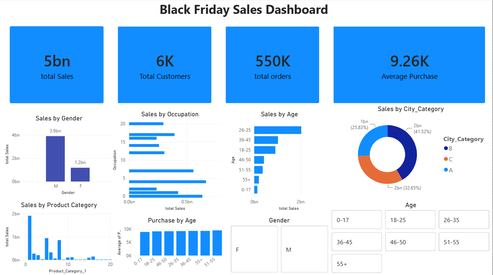

# 🛍️ Black Friday Sales Analysis & Dashboard

## 📌 Project Overview

This project performs an end-to-end analysis of the Black Friday Sales dataset using Python, Machine Learning, and Microsoft Power BI.

The project covers:

- Data Cleaning & Preprocessing
- Exploratory Data Analysis (EDA)
- Feature Engineering
- Linear Regression Model
- Interactive Power BI Dashboard
- Business Insights

---

# 📊 Dashboard Preview

> Add a screenshot named **dashboard.png** in this repository.



---

# 📂 Project Structure

```
Black-Friday-Sales-Analysis
│
├── EDA.ipynb
├── BlackFriday.pbix
├── Dashboard.png
├── README.md
└── data
    └── train.csv
    └── test.csv
```

---

# 🛠️ Technologies Used

- Python
- Pandas
- NumPy
- Matplotlib
- Seaborn
- Scikit-learn
- Microsoft Power BI
- Power Query
- DAX
- Git & GitHub

---

# 📈 Exploratory Data Analysis

Performed analysis on:

- Missing Values
- Data Cleaning
- Feature Encoding
- Customer Demographics
- Purchase Behaviour
- Product Categories
- Sales Distribution
- Correlation Analysis

---

# 🤖 Machine Learning

### Model Used

- Linear Regression

### Workflow

- Data Preprocessing
- Train-Test Split
- Model Training
- Prediction
- Model Evaluation

---

# 📊 Power BI Dashboard

The dashboard contains:

### KPI Cards

- Total Sales
- Total Customers
- Total Orders
- Average Purchase

### Visualizations

- Sales by Gender
- Sales by Occupation
- Sales by Age Group
- Sales by City Category
- Product Category Sales
- Average Purchase by Age

### Interactive Filters

- Gender
- Age
- City Category
- Marital Status

---

# 💡 Key Business Insights

- Male customers generated significantly higher total sales than female customers.
- Customers aged **26–35** contributed the highest revenue.
- City Category **B** generated the largest share of total sales.
- Product Category 1 generated the highest sales.
- The average purchase amount is approximately **9.26K**.
- The dataset contains approximately **550K** purchase transactions from nearly **6K** unique customers.

---

# 🚀 Future Improvements

- Implement advanced Machine Learning models.
- Add forecasting analysis.
- Connect Power BI to SQL Server.
- Create an interactive executive dashboard.

---

# 👨‍💻 Author

**Dev**

If you found this project useful, feel free to ⭐ the repository.
